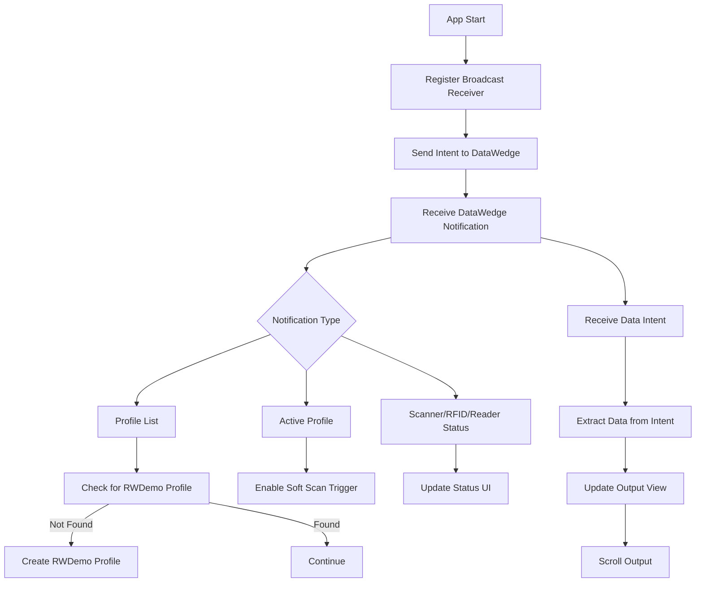

# DESIGN.md

## Project: Zebra RFID RWDemo

### Release Version
- 1.0.6.1

### Overview
This project is an Android application designed for Zebra RFID devices, specifically targeting the EM45 hardware. It demonstrates RFID reading, device interaction, and provides a sample UI for RFID operations.

### Architecture
- **Language:** Java
- **Build System:** Gradle
- **Structure:**
  - `app/` contains the main Android application code
  - `libs/` contains third-party and Zebra-provided libraries
  - `build_deploy_launch.sh` automates build, deploy, and launch

### Key Components
- **RWDemoActivity:** Main activity for user interaction
- **RWDemoIntentParams:** Intent parameter definitions for RFID operations
- **FriendlyProfilesActivity:** Example of profile management

### Platform Compatibility Notes
- Android 13+ broadcast receiver registration uses exported receiver flag for DataWedge result intent handling
- Deployment script launches debug build package ID (`com.zebra.rfid.rwdemo.debug`) to avoid persistent preloaded package replacement restrictions on TC22R

### Build & Deployment
- Use the provided shell script for automated build, deployment, and launch on TC22R
- Gradle wrapper included for consistent builds

### Extensibility
- Modular structure for adding new features or device support
- Easy integration with additional Zebra SDKs

## Scanner and RFID Status Update

The application updates scanner and RFID status in real-time using Android broadcast receivers and UI elements:

- **Broadcast Receiver:**
  - The `datawedgeBroadcastReceiver` listens for DataWedge notifications and profile changes.
  - It handles actions such as `ACTION_NOTIFICATION` and updates status fields based on received notification type and status.

- **Status UI Elements:**
  - `scannerStatus`, `rfidStatus`, and `readerStatus` are `TextView` elements in the main activity.
  - When a notification is received:
    - **Scanner:** Updates with the current scanner status (e.g., "S: READY").
    - **RFID:** Updates with RFID state (e.g., "RFID: reading", "RFID: stopped").
    - **Reader:** Updates with reader connection state (e.g., "RD: CONNECTED").

- **Soft Scan Trigger:**
  - The soft scan button enables/disables RFID reading and updates the status accordingly.

## Data Delivery

- **Intent API:**
  - DataWedge delivers scanned RFID tag data to the app via Android intents.
  - The main activity receives intents containing tag data and source information.

- **Data Handling:**
  - The `handleDecodeData(Intent i)` method extracts data from the intent and updates the output view.
  - If RFID data is present, it is appended to the display and the scroll view is updated.
  - MSR (magstripe) data is handled separately and displayed as encrypted if present.

- **UI Update:**
  - The output view (`TextView`) is updated with new data, and the scroll view automatically scrolls to show the latest entry.

## DataWedge Registration, Data Reception, and Initialization Flowchart

**Flow Description:**
- The app starts and registers a broadcast receiver for DataWedge notifications.
- It sends an intent to DataWedge to initialize and request profile information.
- Upon receiving notifications, it checks the notification type:
  - Profile list: Checks for the RWDemo profile and creates it if missing.
  - Active profile: Enables the scan trigger.
  - Status notifications: Updates scanner, RFID, and reader status UI.
- When data is received via intent, it is extracted and displayed in the output view, with the scroll view updated.

---

**Summary:**
- Status updates are driven by DataWedge notifications and reflected in the UI.
- Data delivery uses Android intents, processed and displayed in real-time.
