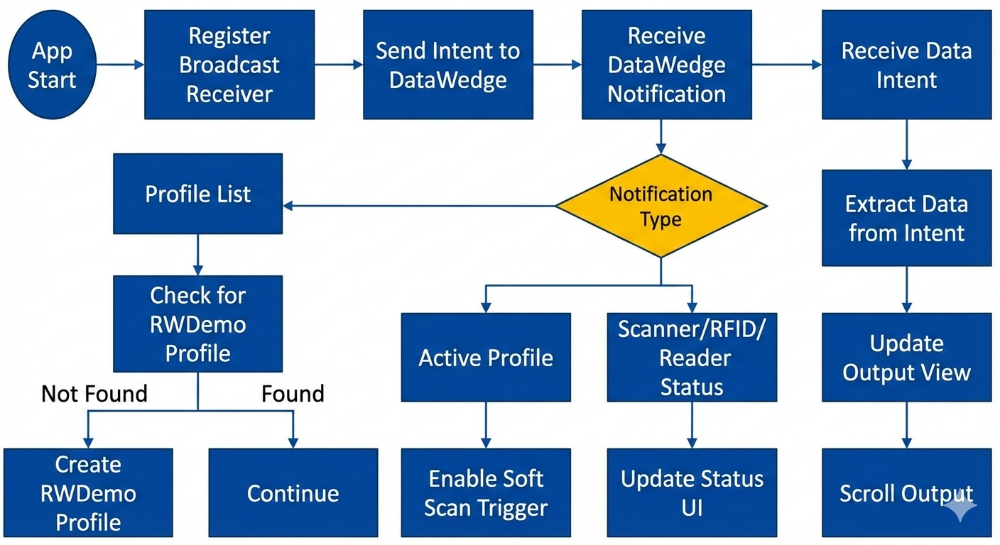

# Zebra RFID RWDemo

Android sample app that reads RFID data from Zebra DataWedge intents and displays live results.

## Version
- `1.0.6.2`

## What It Does
- creates/uses a DataWedge profile for this app
- starts/stops RFID reads with soft trigger
- shows scanner/RFID/reader status in header
- tracks read counters (`Total`, `Unique`)
- displays unique tags only in the output list
- clears previous session data when a new read session starts

## Requirements
- Android SDK installed
- Java 8+
- `adb` available in shell
- Zebra device with DataWedge

## Build
```bash
./gradlew assembleDebug
```

APK output:
`app/build/outputs/apk/debug/app-debug.apk`

## Deploy and Launch

### One-command script
```bash
./build_deploy_launch.sh
```

### Manual
```bash
adb install -r app/build/outputs/apk/debug/app-debug.apk
adb shell am start -n com.zebra.rfid.rwdemo.debug/com.zebra.rfid.rwdemo.RWDemoActivity
```

## Project Layout
- `app/` Android app source and resources
- `libs/` bundled AAR dependencies
- `build_deploy_launch.sh` build/deploy/launch helper
- `DESIGN.md` architecture and behavior notes

## Design Flowchart



Flow summary:
- Register DataWedge receivers and request profile state.
- Ensure `RWDemo` profile exists and activate soft scan trigger.
- Receive scanner/RFID/reader notifications and update status UI.
- Handle RFID intent payloads, dedupe tag rows, and update `Total`/`Unique` counters.

## Notes
- Android 13+ receiver registration path is supported.
- Debug build uses package `com.zebra.rfid.rwdemo.debug`.

## Troubleshooting

### `Unable to access jarfile .../gradle/wrapper/gradle-wrapper.jar`
- Ensure `gradle/wrapper/gradle-wrapper.jar` exists.
- If missing, restore it from the Gradle tag matching `gradle-wrapper.properties`.

### No device found in `adb devices`
- Enable USB debugging / wireless debugging on the device.
- Reconnect and re-run:
	```bash
	adb devices
	```

### Install succeeds but app does not launch
- Launch manually with:
	```bash
	adb shell am start -n com.zebra.rfid.rwdemo.debug/com.zebra.rfid.rwdemo.RWDemoActivity
	```

### Reads not appearing
- Confirm DataWedge is enabled and the app profile is active.
- Verify header status values (`S:`, `RFID:`, `RD:`) update.

### "Missing tags" in output
- Output intentionally shows only unique tags per read session.
- Deduplication ignores case, spaces, and hyphens.
- `Total` still counts every read event; `Unique` counts first-seen tags.

